# Azure OAuth2 OIDC Auth Code Flow demonstration

The goal of this repository is to demonstrate how to incorporate [OAuth 2.0](https://datatracker.ietf.org/doc/html/rfc6749) on Azure **WITHOUT** the use of [MSAL](https://learn.microsoft.com/en-us/entra/identity-platform/msal-overview) for learning purposes.
In a production environment one should (almost) always use MSAL or similar battle-tested libraries, but it is vital for any software engineer to understand what is going on under the hood instead of just blindly calling a library which
automagically solves all your needs (this also applies for frameworks).

The repo contains code for both the client and the server. The client is utilizing [OpenID Connect (OIDC)](https://auth0.com/docs/authenticate/protocols/openid-connect-protocol) with 
Auth code flow. A comprehensive guide is included on how to register the client and server on Azure Entra ID. 

## Requirements

- **Platform**: x86-64, Linux/WSL
- **Programming Language**: [Python 3](https://www.python.org/downloads/)
- **Azure Account**: Access to [Azure Subscription](https://azure.microsoft.com/en-us/pricing/purchase-options/azure-account)
- **IAC Tool**: [Terraform](https://www.terraform.io/) 


## Allocate resources

The script [up](up.sh) provisions Azure resources by applying our [Terraform script](infra/terraform.tf).

It is necessary to create a file named **terraform.tfvars** in the [infra](infra) directory. This file holds sensitive information
necessary for terraform to be able to interact with your cloud resources, namely that of your tenant and subscription id. 
An exemption for this file has been added in our [.gitignore](.gitignore) so that you do not accidentally commit it. 

The file structure is as follows:

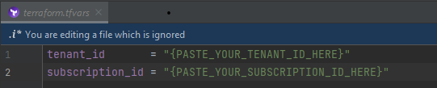

## Download Publish Profile

Now that we have provisioned our Azure Web App resource, we may proceed to set up our CI/CD pipeline - which is used for deploying our local Python API to Azure. 
However, we first need to download the associated the **publish profile** associated with said Azure Web App. 
In Azure, access the newly created Web App resource.
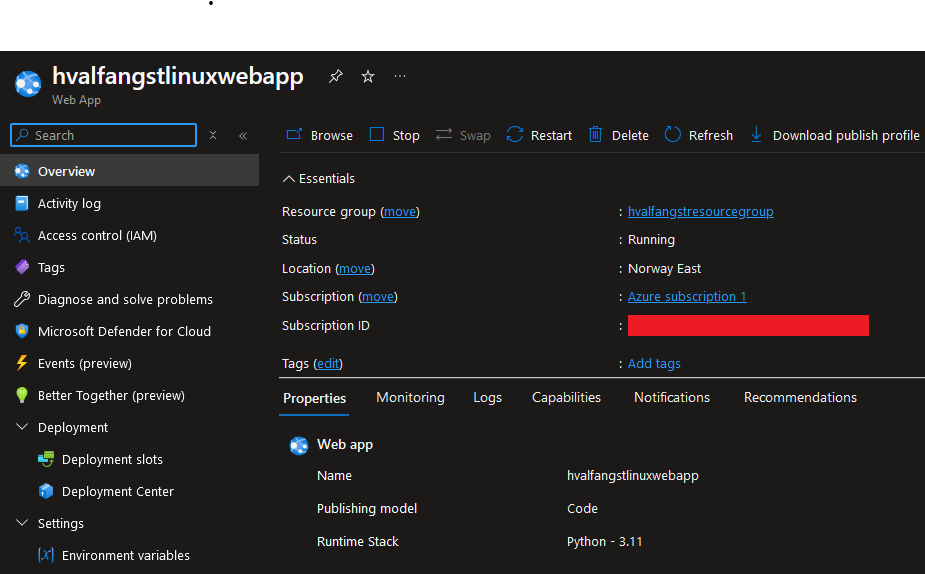

Click on the **Download publish profile** button in the top right corner. 

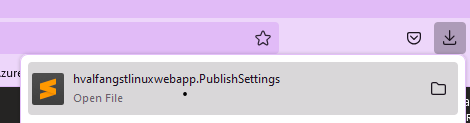

The associated file contents will be utilized in the next section.

## Set up CI/CD pipeline

In order to deploy our Python API to Azure Web Apps, one has to create a secret named **AZURE_WEBAPP_PUBLISH_PROFILE**. A GitHub Actions Workflow script which utilizes
this to deploy the application has [already been provided](.github/workflows/deploy.yml). Navigate to the **security** section under your GitHub repository settings. Click on **Actions** under **Secrets and variables**. 


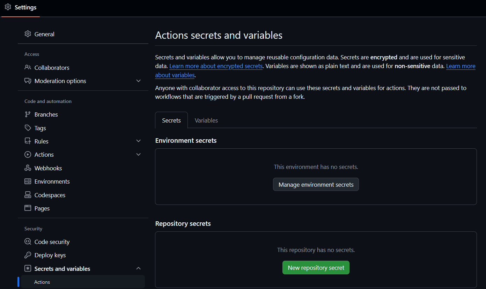

Proceed to create a new secret by clicking on the green **New repository secret** button. Secret name must be as specified. Copy & paste the contents of the recently downloaded publish profile to the secret field.

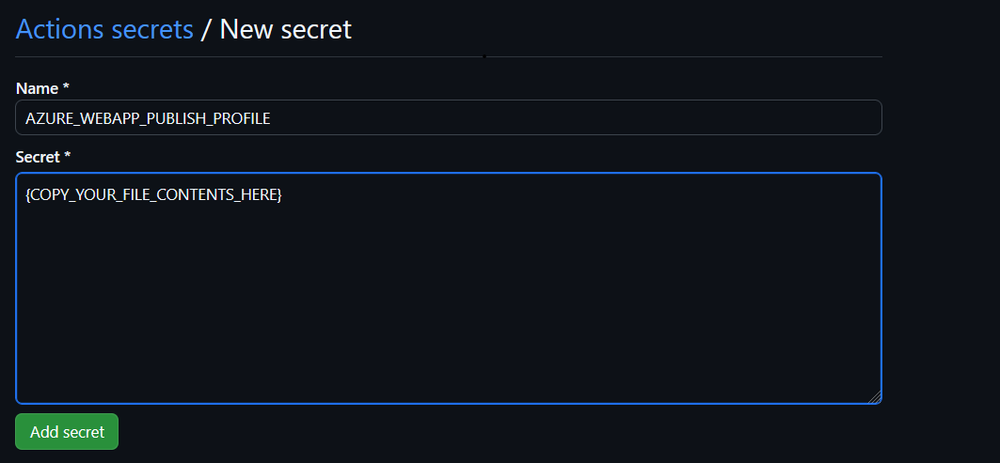


## Register API on Azure AD

### Create a new app registration

Navigate to the **App registrations** blade and click on **New registration** button in the top left tab

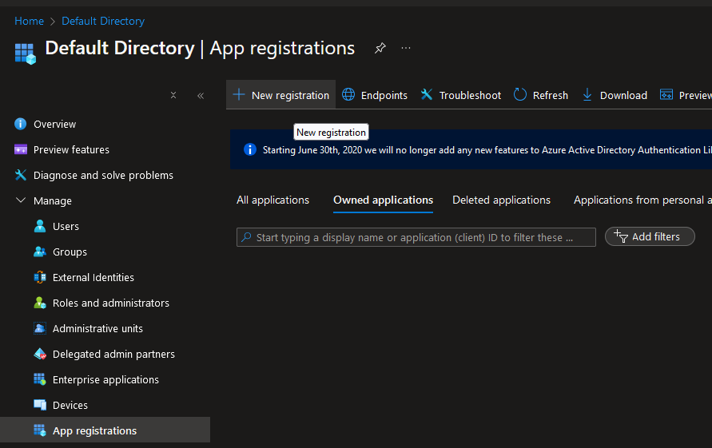

Fill in the name of your application, whether it is single or multi-tenant and the redirect URI.

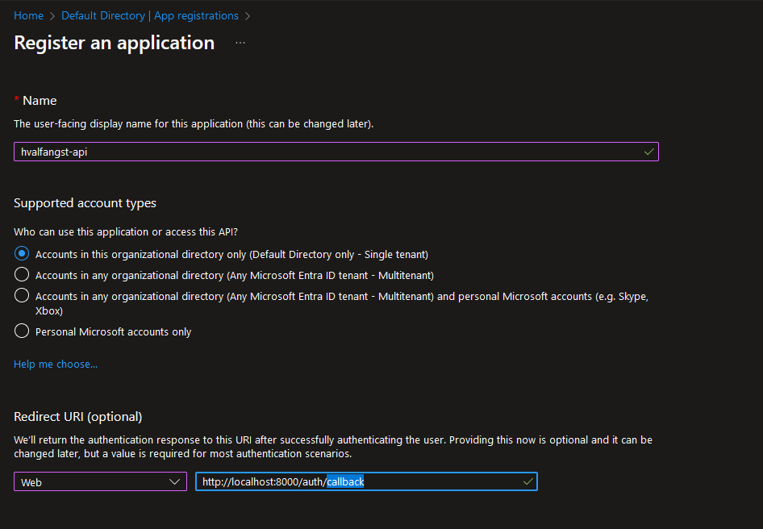

In our case the redirect URI is necessary and **MUST** be set to 
http://localhost:8000/auth/callback as this is an actual [endpoint](app/routers/auth.py) in our auth router. Click on the **Register** button (omitted) to complete the app registration.


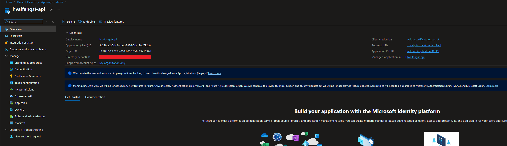

When the registration has succeeded, one will be redirected to the associated newly created registration. Proceed to copy & store the **client** and **tenant ID** for future use. 

### Generate client secret

Now that we have registered our API, we need to generate an associated client secret. Proceed to click on **New client secret**

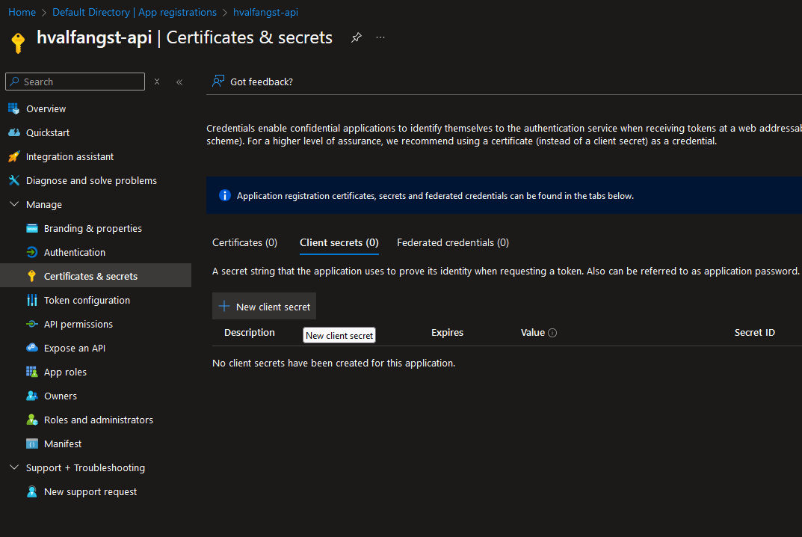

Enter a description and an expiry date. For demonstration purposes I set the secret duration to 1 day. Click on the **Add** button on the bottom left.

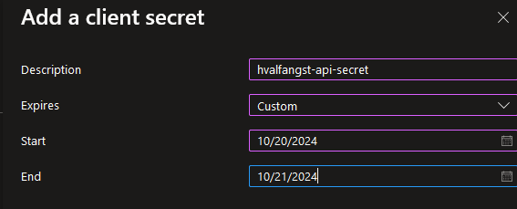

Now that we have our secret it is important to copy and store it's associated value. It is this which is referred to as **client secret**. It is important not to mix this up with **Secret ID**, which is merely the ID of the resource.

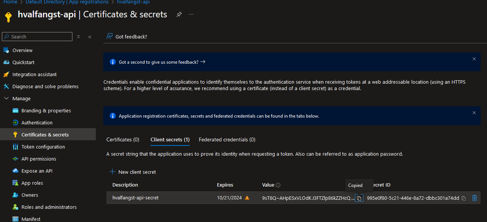

### Create scope

Now that we have our client secret we may proceed to register the actual scope available in the API. In order to do so one must navigate to the **Expose an API** blade. Click on **Add a scope**.

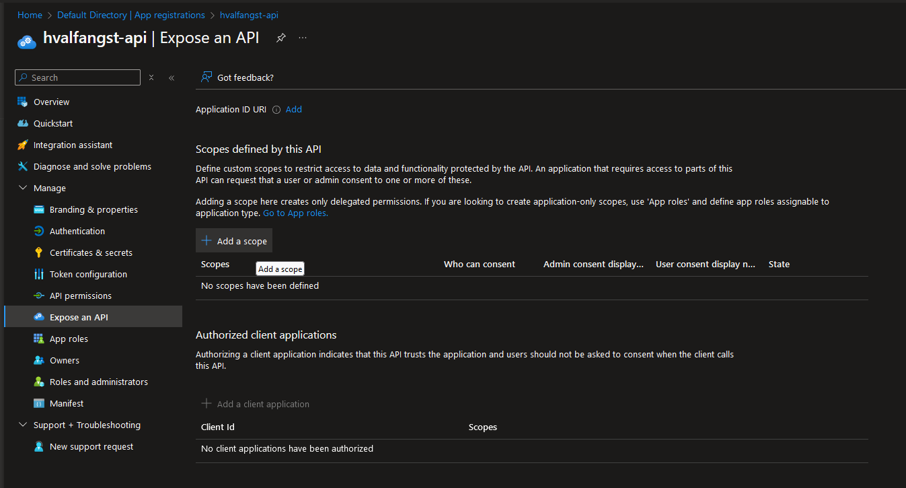

You will be prompted to set an application id uri. Keep the autogenerated one as is and click **Save and continue**.

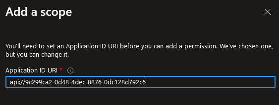

After an application URI has been registered, you will be prompted to register a scope.  Proceed to set the scope name of **Heroes.Read**. Note that one is free to
set any scope name that one so desires, but it is common practice utilizing the controller domain followed by some access rights categories, such as **READ**, **WRITE**, **EDIT** and **DELETE**. Thus, 
our chosen scope grants the right to access the GET endpoints contained in the [heroes router](app/routers/heroes.py), which are utilized in order to list all heroes and view a specific one.
One could take inspiration from Azure's built-in scopes for certain resources, such as Key Vault, Blob Storage etc.

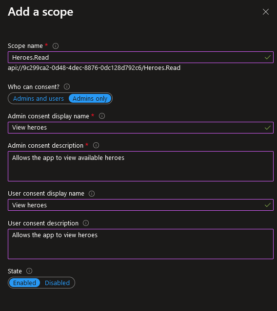

Copy the value associated with the newly created scope.

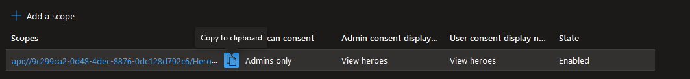

### Create environment file

In order for this application to work, one has to have a file named **.env_oauth** in the root folder.
This file is to contain variables utilized in order to communicate with the Azure Authorization server.

These variables are the azure **client and tenant id**, the **client secret**, the **api scope** and the **redirect uri**. Recall that you were instructed to copy and store
the associated values used to populate these variables in earlier sections.

The final file should look as follows:


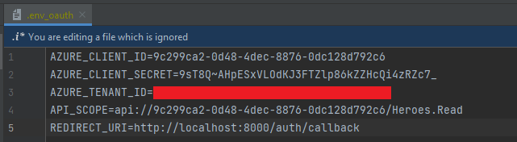

## Flow: callback

As mentioned earlier, we have a callback endpoint registered, whose URI matches the one specified in the registration.

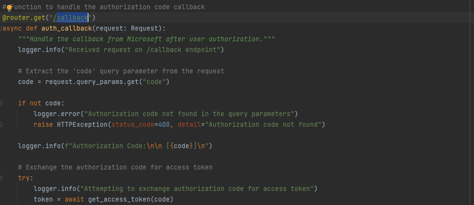

After the user logs in via Microsoft, they are redirected to this endpoint. The redirection includes an authorization code in the query params as such:

```http request
http://localhost:8000/auth/callback?code=AUTH_CODE
```

This code will in turn be exchanged for an access token in the [get_access_token](app/services/auth_service.py) function:

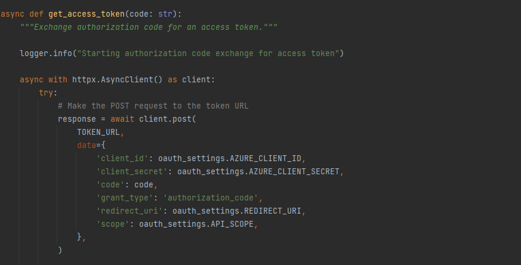

As one may observe the token is used in conjunction with the client id and secret, hence the code being in a query param in the callback. If not it would be a major security vulnerability.
Note that for some applications such as mobile apps and SPA's (12) one should not operate with client secrets as storing them safely locally is impossible. For instance, a hacker may easily decompile
your beloved app and grab the client secret as it would be imprinted in the app itself.


## Running API
```bash
python -m uvicorn app.main:app --reload
```
